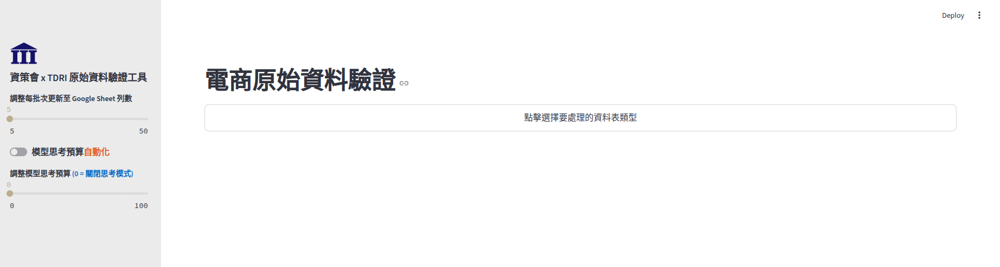
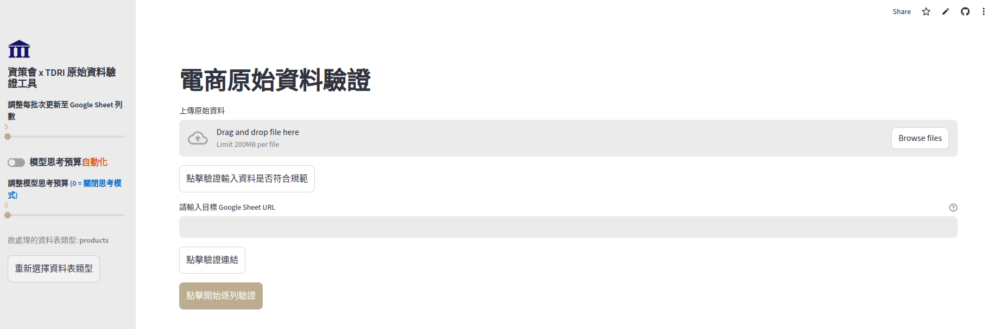

# 設研院產品資料分類驗證程式

> 此專案串接 LLM，用來檢查 **products, reference** 資料的分類（category, subcategory, further_subcategory）是否精確，以及 **products_extend** 報表的 tag 之精確度。

## Products & Reference
> 此工具串接 LLM，判斷 products 與 reference 兩張表的分類是否精確。一共有兩種方法：Real-time API 與 Batch API。

### Real-time API - accessible from streamlit
#### Web Service (Cloud)

> 請透過[**此連結**](https://tdridataverifier-jagdvoykf7ckh2w65vjn7g.streamlit.app/)來進入專案。

##### Demo
- Step 1: 選擇欲驗證的資料表種類。此工具僅支援 products, reference 兩表的驗證。


- Step 2: 上傳欲驗證的資料以及用來存放驗證結果的 Google Sheet（需要設為公開編輯）並設定其他參數後，點擊按鈕開始逐列驗證。


##### Caviet 
- 該專案是串 Gemini 逐列驗證，速度會十分緩慢，且極有可能超過 Gemini 的 daily request limit！
- 若資料量過大，請不要使用 Streamlit App，使用 OpenAI 的 Batch API 會快一點，請參考 `openai_batch.ipynb`。

#### Build Setup (Local)
Clone the repository by the following command:
```
git clone https://github.com/taaqat/tdri_data_verifier.git
```
Then install required packages:

```
pip install -r requirements.txt
```
Also remember to configure your `.streamlit/secrets.toml` file, which requires Gemimi API key and Google Service Account Credential:
```
[api_keys]
GEMINI_KEY = "YOUR GEMINI API KEY"

[gsheet-credits]
credits = '''{"type": "service_account",
"project_id":  "YOUR_PROJECT_ID",
"private_key_id": "YOUR_PRIVATE_KEY_ID",
"private_key": "YOUR_PRIVATE_KEY",
"client_email" : "YOUR_CLIENT_EMAIL",
"client_id": "YOUR_CLIENT_ID",
"auth_uri": "https://accounts.google.com/o/oauth2/auth",
"token_uri": "https://oauth2.googleapis.com/token",
"auth_provider_x509_cert_url": "https://www.googleapis.com/oauth2/v1/certs",
"client_x509_cert_url": "YOUR_CLIENT_X509_CERT_URL",
"universe_domain": "googleapis.com"}'''
```
Finally, execute by the following command:
```
streamlit run main.py
```

### Batch API
> 請參照 [openai_batch.ipynb](./openai_batch.ipynb)

務必要**注意使用的模型種類**，以免花了冤枉錢（ex：若你只輸入 gpt-4 而不細說模型 checkpoint，OpenAI 會直接幫你導流到最貴的模型，價差可達 6 倍）！

Remember to edit your .env file for storing LLM api keys:
```
GEMINI_KEY = ""
OPENAI_KEY = ""
CLAUDE_KEY = ""
```

## Products Extend
Remember to edit your .env file for storing LLM api keys:
```
GEMINI_KEY = ""
OPENAI_KEY = ""
CLAUDE_KEY = ""
```
> 請參照 [products_extend.ipynb](./products_extend.ipynb)